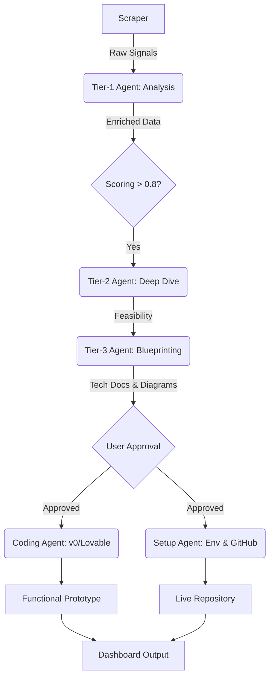

# 🚀 MicroHack 3.0: Intelligence Engine & Strategic Surveillance

[](https://fastapi.tiangolo.com/)
[](https://reactjs.org/)
[](https://www.postgresql.org/)
[](https://www.docker.com/)
[](https://langchain-ai.github.io/langgraph/)

Welcome to **MicroHack 3.0**, a professional-grade competitive intelligence platform designed to decode market signals, identify strategic gaps, and provide actionable insights for innovation strategies.

---

## 🏗️ System Architecture

Our platform is a multi-agent ecosystem designed for high-performance data processing:

1.  **Phase 1: Scraping Engine**: Automatically harvests data from Patents, RSS feeds, Tech News, and Academic sources.
2.  **Phase 2: Multi-Agent Analysis**:
    - **Tier 1 (Analyst)**: Uses AI (LangGraph + Gemini) to clean, categorize, and score incoming signals.
    - **Tier 2 (Deep Dive)**: Performs feasibility studies on high-scoring opportunities.
3.  **Phase 3: Multi-Agent Blueprinting**: Generates detailed technical documentation and conception diagrams (UML/System) for the selected innovation.
4.  **Phase 4: Multi-Agent Prototyping**: Integrates with external coding agents like **v0** and **Lovable** to generate functional code based on the blueprints.
5.  **Phase 5: Multi-Agent Orchestration**: Automates environment setup, including GitHub repository creation, dependency management, and project structure initialization.

### 🔄 End-to-End Workflow


---

## 🛠️ Tech Stack

- **Backend**: Python 3.10+, FastAPI, SQLAlchemy, Pydantic.
- **Frontend**: React, Vite, CSS Modules.
- **Agents**: LangGraph, LangChain, Google Gemini Pro.
- **Infrastructure**: Docker, Redis, RabbitMQ, PostgreSQL, MinIO.

---

## ⚡ Setup & Execution

### 1. Prerequisites
- Docker & Docker Compose installed.

### 2. Build and Run
To build the images and start the entire ecosystem in one go, run:
```bash
docker compose up --build
```

---

## 🌐 Accessing the Platform

Once the containers are running:

- **Dashboard (Frontend)**: [http://localhost](http://localhost)
- **API Documentation**: [http://localhost:8000/docs](http://localhost:8000/docs)
- **Health Check**: [http://localhost:8000/health](http://localhost:8000/health)

---

## 📁 Repository Structure

```text
.
├── backend/            # FastAPI API & Multi-Agent Logic
│   ├── agents/         # LangGraph Tier-1 & Tier-2 scripts
│   ├── app/            # Main FastAPI application
│   ├── scraper/        # Scraper Graph logic
│   └── scripts/        # Database & Utility scripts
├── frontend/           # React + Vite Dashboard
├── documentation/      # Detailed ARCHITECTURE & HACKATHON info
└── docker-compose.yml  # System Orchestration
```

---

## 🏆 Development
Developed for the **MicroHack 3.0 Hackathon**. This project demonstrates the power of multi-agent systems in corporate scouting and competitive intelligence.

---

## 🤝 Connect
Let's connect on **[LinkedIn](https://www.linkedin.com/in/YOUR_PROFILE_HERE/)**!
