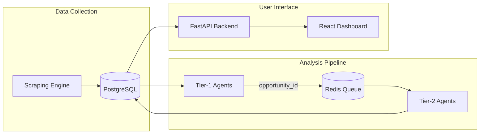
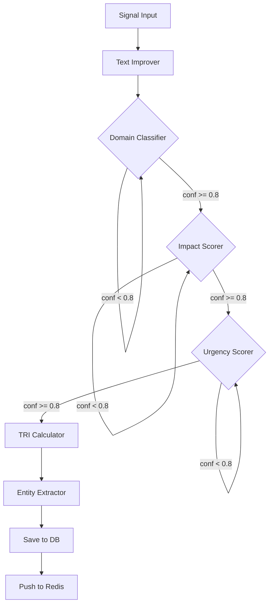

# 🚀 APCS - Autonomous Pipeline for Corporate Scouting
## **MicroHack 3.0 Project Documentation**

---

## 📋 Table of Contents
1. [Executive Summary](#executive-summary)
2. [System Architecture Overview](#system-architecture-overview)
3. [Tech Stack](#tech-stack)
4. [Multi-Agent System Design](#multi-agent-system-design)
5. [Backend API](#backend-api)
6. [Frontend Dashboard](#frontend-dashboard)
7. [Database Schema](#database-schema)
8. [How to Run the Project](#how-to-run-the-project)
9. [API Endpoints](#api-endpoints)
10. [Workflow Diagrams](#workflow-diagrams)

---

## 🎯 Executive Summary

**APCS (Autonomous Pipeline for Corporate Scouting)** is an AI-powered innovation management platform that automates the entire lifecycle of technology signal detection, analysis, and strategic decision-making. 

### The Problem We Solve
Companies struggle to:
- Monitor emerging technologies across multiple sources
- Quickly assess which innovations are worth pursuing
- Generate actionable feasibility studies
- Create implementation blueprints for approved ideas

### Our Solution
A **fully autonomous multi-agent pipeline** that:
1. **Scrapes** technology signals from patents, RSS feeds, tech news, and academic papers
2. **Analyzes** signals using AI agents (domain classification, impact/urgency scoring)
3. **Generates** deep feasibility studies for high-potential opportunities
4. **Creates** implementation-ready blueprints with architecture, code schemas, and UI prompts

---

## 🏗️ System Architecture Overview

```
┌─────────────────────────────────────────────────────────────────────────────┐
│                           APCS ARCHITECTURE                                 │
├─────────────────────────────────────────────────────────────────────────────┤
│                                                                             │
│   ┌─────────────────┐     ┌──────────────────┐     ┌──────────────────┐   │
│   │   SCRAPING      │     │   TIER-1 AGENTS  │     │   TIER-2 AGENTS  │   │
│   │   ENGINE        │────▶│   (Analysis)     │────▶│   (Deep Dive)    │   │
│   │  (first_graphe) │     │  (multiagent1)   │     │  (multiagent2)   │   │
│   └─────────────────┘     └──────────────────┘     └──────────────────┘   │
│           │                        │                        │              │
│           │                        │                        │              │
│           ▼                        ▼                        ▼              │
│   ┌─────────────────────────────────────────────────────────────────────┐ │
│   │                         PostgreSQL Database                          │ │
│   │   (signals, opportunities, feasibility_studies, blueprints)         │ │
│   └─────────────────────────────────────────────────────────────────────┘ │
│                                    │                                       │
│                                    ▼                                       │
│   ┌─────────────────────────────────────────────────────────────────────┐ │
│   │                       FastAPI Backend Server                         │ │
│   │                          (REST API)                                  │ │
│   └─────────────────────────────────────────────────────────────────────┘ │
│                                    │                                       │
│                                    ▼                                       │
│   ┌─────────────────────────────────────────────────────────────────────┐ │
│   │                     React + Vite Dashboard                           │ │
│   │              (Dashboard, Signals, Pipeline, Alerts)                  │ │
│   └─────────────────────────────────────────────────────────────────────┘ │
│                                                                             │
│   ┌────────────────────────────────┐                                       │
│   │        Redis Queue             │◀── Message passing between agents     │
│   └────────────────────────────────┘                                       │
│                                                                             │
└─────────────────────────────────────────────────────────────────────────────┘
```

---

## 🛠️ Tech Stack

### Backend
| Component | Technology | Purpose |
|-----------|------------|---------|
| API Framework | **FastAPI** (Python 3.11) | High-performance REST API |
| Database | **PostgreSQL 15** | Persistent storage |
| ORM | **SQLAlchemy 2.0** | Database interactions |
| Migrations | **Alembic** | Database versioning |
| Message Queue | **Redis** | Agent communication |
| AI Framework | **LangGraph + LangChain** | Multi-agent orchestration |
| LLM Provider | **Google Gemini 1.5 Flash** | Language model for agents |
| Authentication | **JWT (python-jose)** | Secure API access |

### Frontend
| Component | Technology | Purpose |
|-----------|------------|---------|
| Framework | **React 19** | UI framework |
| Build Tool | **Vite (rolldown)** | Fast development server |
| Routing | **React Router v7** | Page navigation |
| Charts | **ECharts** | Data visualization |
| Animations | **Framer Motion** | Smooth UI transitions |
| Markdown | **React-Markdown** | Rendering AI-generated content |
| Diagrams | **Mermaid.js** | Architecture visualizations |

### DevOps
| Component | Technology | Purpose |
|-----------|------------|---------|
| Containerization | **Docker + Docker Compose** | Service orchestration |
| Task Scheduling | **Celery** | Periodic scraping jobs |

---

## 🤖 Multi-Agent System Design

### Overview
The project uses **LangGraph** to orchestrate multiple specialized AI agents in a **ReAct (Reasoning + Action) pattern**. Each agent has:
- A specific task (domain classification, impact scoring, etc.)
- Confidence-based retry logic (if confidence < 0.8, agent retries)
- State persistence via PostgreSQL checkpointing

---

### 🔵 TIER-1: Signal Analysis Pipeline (`multiagent1/`)

**Purpose:** Process raw technology signals and extract structured insights.

```
START
  │
  ▼
┌─────────────────────────────┐
│  Agent 1: Text Improver     │ ── Fixes grammar, improves clarity
└─────────────────────────────┘
  │
  ▼
┌─────────────────────────────┐
│  Agent 2: Domain Classifier │ ── Classifies into 17 tech domains
│  (ReAct Loop: retry < 0.8)  │    (AI/ML, IoT, Blockchain, etc.)
└─────────────────────────────┘
  │
  ▼
┌─────────────────────────────┐
│  Agent 3: Impact Scorer     │ ── Rates global impact (0.0-1.0)
│  (ReAct Loop: retry < 0.8)  │
└─────────────────────────────┘
  │
  ▼
┌─────────────────────────────┐
│  Agent 4: Urgency Scorer    │ ── Rates time-sensitivity (0.0-1.0)
│  (ReAct Loop: retry < 0.8)  │
└─────────────────────────────┘
  │
  ▼
┌─────────────────────────────┐
│  Agent 5: TRI Calculator    │ ── Technology Readiness Index (1-9)
└─────────────────────────────┘
  │
  ▼
┌─────────────────────────────┐
│  Agent 6: Entity Extractor  │ ── Extracts companies, technologies,
└─────────────────────────────┘    locations mentioned
  │
  ▼
┌─────────────────────────────┐
│  Database Node              │ ── Saves to `signal_analysis_opportunity`
└─────────────────────────────┘
  │
  ▼
┌─────────────────────────────┐
│  Redis Push Node            │ ── Publishes opportunity_id to queue
└─────────────────────────────┘    for Tier-2 processing
  │
  ▼
 END
```

**Key Files:**
- `workflow.py` - LangGraph workflow definition
- `state.py` - GraphState TypedDict with operator annotations
- `agents/` - Individual agent implementations

---

### 🟢 TIER-2: Feasibility Deep-Dive Pipeline (`multiagent2/`)

**Purpose:** Perform in-depth analysis on promising opportunities.

```
START (Redis Event)
  │
  ▼
┌─────────────────────────────┐
│  Agent 1: Tech Assessor     │ ── Detailed technical requirements
│  (ReAct Loop)               │    analysis with markdown report
└─────────────────────────────┘
  │
  ▼
┌─────────────────────────────┐
│  Agent 2: Stack Designer    │ ── Recommends technology stack
│  (ReAct Loop)               │    and architecture patterns
└─────────────────────────────┘
  │
  ▼
┌─────────────────────────────┐
│  Agent 3: Market Analyst    │ ── Market size, competitors,
│  (ReAct Loop)               │    strategic positioning
└─────────────────────────────┘
  │
  ▼
┌─────────────────────────────────────────────┐
│  Agent 4: Feasibility Expert                │
│  ╔═══════════════════════════════════════╗  │
│  ║  PIVOT LOOP: If score < 0.5           ║  │
│  ║  → Sends back to Stack Designer       ║  │
│  ╚═══════════════════════════════════════╝  │
└─────────────────────────────────────────────┘
  │
  ▼
┌─────────────────────────────┐
│  Agent 5: Strategist        │ ── Final GO/NO-GO recommendation
└─────────────────────────────┘    and executive summary
  │
  ▼
 DATABASE (feasibility_studies table)
```

**Unique Feature:** The **Feasibility Expert** can send projects back to the Stack Designer if the initial architecture is deemed unfeasible, creating an iterative improvement loop.

---

### 🔴 Graph 0: Scraping Engine (`first_graphe/`)

**Purpose:** Autonomous data collection from multiple sources.

```
┌──────────────────┐
│   Orchestrator   │ ── Decides when to trigger scraping
└────────┬─────────┘    (every 5 hours or manual)
         │
         ▼
┌──────────────────────────────────────────┐
│           Parallel Scrapers              │
│  ┌─────────┐ ┌─────────┐ ┌────────────┐ │
│  │ Patents │ │   RSS   │ │ Tech News  │ │
│  └─────────┘ └─────────┘ └────────────┘ │
│        ┌──────────┐                     │
│        │ Academic │                     │
│        └──────────┘                     │
└──────────────────────────────────────────┘
         │
         ▼
┌──────────────────┐
│  Quality Filter  │ ── Validates content integrity
└────────┬─────────┘
         │
         ▼
┌──────────────────┐
│    Formatter     │ ── Standardizes to schema
└────────┬─────────┘
         │
         ▼
┌──────────────────┐
│     Handoff      │ ── Publishes to PostgreSQL
└──────────────────┘
```

**Scrapers Implemented:**
- `patent_scraper.py` - USPTO, Google Patents
- `rss_scraper.py` - Tech RSS feeds (TechCrunch, Wired, etc.)
- `tech_news_scraper.py` - Technology news sites
- `academic_scraper.py` - arXiv, academic papers
- `lens_scraper.py` - The Lens patent/scholarly search

---

## 🖥️ Backend API

### Project Structure
```
MicroHack-3.0-Back/
├── app/
│   ├── main.py              # FastAPI app entry point
│   ├── config.py            # Environment configuration
│   ├── dependencies.py      # DB session, auth dependencies
│   ├── models/              # SQLAlchemy models
│   │   ├── signal.py        # Signals table
│   │   ├── opportunity.py   # Analysis opportunities
│   │   ├── feasibility.py   # Feasibility studies
│   │   ├── blueprint.py     # Venture blueprints
│   │   ├── alert.py         # Alert notifications
│   │   └── user.py          # User authentication
│   ├── routers/             # API endpoints
│   │   ├── signals.py       # /api/v1/signals
│   │   ├── pipeline.py      # /api/v1/pipeline
│   │   ├── feasibility.py   # /api/v1/feasibility-studies
│   │   ├── blueprints.py    # /api/v1/blueprints
│   │   ├── alerts.py        # /api/v1/alerts
│   │   ├── analytics.py     # /api/v1/analytics
│   │   └── auth.py          # /api/v1/auth
│   ├── services/            # Business logic layer
│   │   ├── signal_service.py
│   │   ├── blueprint_service.py  # AI-powered blueprint generation
│   │   └── feasibility_service.py
│   └── schemas/             # Pydantic request/response models
├── micro_hack/
│   ├── multiagent1/         # Tier-1 analysis agents
│   └── multiagent2/         # Tier-2 feasibility agents
├── first_graphe/            # Scraping engine
├── docker-compose.yml       # Service orchestration
├── Dockerfile               # Backend container
└── requirements.txt         # Python dependencies
```

---

## 🎨 Frontend Dashboard

### Project Structure
```
apcs-dashbord/
├── src/
│   ├── App.jsx              # Main router setup
│   ├── main.jsx             # Entry point
│   ├── pages/
│   │   ├── Dashboard/       # Main overview with stats
│   │   ├── SignalsInbox/    # View/accept/reject signals
│   │   ├── InnovationPipeline/  # Stage-based project tracking
│   │   ├── TechnologyTrends/    # Tech radar visualization
│   │   ├── Alerts/          # Alert management
│   │   ├── FeasibilityDetail/   # Deep-dive analysis view
│   │   └── BlueprintWorkspace/  # AI-generated blueprints
│   ├── components/
│   │   ├── dashboard/       # StatCard, TechnologySignal
│   │   ├── signals/         # SignalCard components
│   │   ├── pipeline/        # PipelineStageCard, ProjectCard
│   │   ├── common/          # FilterTabs, Mermaid renderer
│   │   └── layout/          # Header, Sidebar, Layout
│   ├── services/
│   │   ├── api.js           # Base API client
│   │   ├── signalsService.js
│   │   ├── feasibilityService.js
│   │   └── blueprintService.js
│   ├── hooks/               # Custom React hooks
│   │   ├── useSignals.js
│   │   ├── usePipelineData.js
│   │   └── useDashboardData.js
│   └── context/
│       └── AuthContext.jsx  # Authentication state
└── package.json
```

### Key Pages

| Page | Route | Description |
|------|-------|-------------|
| Dashboard | `/` | Overview with stats, recent signals |
| Signals Inbox | `/signals-inbox` | Filter and review opportunity sheets |
| Innovation Pipeline | `/innovation-pipeline` | Kanban-style stage tracking |
| Technology Trends | `/technology-trends` | Tech radar visualization |
| Alerts | `/alerts` | Alert rule management |
| Feasibility Detail | `/feasibility/:id` | Deep-dive analysis report |
| Blueprint Workspace | `/blueprint/:id` | AI-generated implementation guide |

---

## 🗄️ Database Schema

```sql
-- Core Tables
┌────────────────────────────────────────────────────────────────┐
│                          signals                                │
├────────────────────────────────────────────────────────────────┤
│ id (PK)          │ VARCHAR    │ UUID                           │
│ title            │ VARCHAR    │ Signal headline                │
│ full_content     │ TEXT       │ Complete signal text           │
│ source_url       │ VARCHAR    │ Origin URL                     │
│ source_name      │ VARCHAR    │ Source (TechCrunch, arXiv)     │
│ date             │ TIMESTAMP  │ Detection date                 │
│ is_processed     │ BOOLEAN    │ Tier-1 completion flag         │
└────────────────────────────────────────────────────────────────┘
                              │
                              │ 1:1
                              ▼
┌────────────────────────────────────────────────────────────────┐
│                 signal_analysis_opportunity                     │
├────────────────────────────────────────────────────────────────┤
│ id (PK)          │ VARCHAR    │ UUID                           │
│ signal_id (FK)   │ VARCHAR    │ Link to signal                 │
│ primary_domain   │ VARCHAR    │ AI/ML, IoT, Blockchain, etc.   │
│ urgency_score    │ INTEGER    │ 0-10 scale                     │
│ impact_score     │ INTEGER    │ 0-10 scale                     │
│ estimated_trl    │ INTEGER    │ Technology Readiness (1-9)     │
│ companies_mentioned │ TEXT    │ Extracted companies            │
│ technologies_mentioned │ TEXT │ Extracted technologies         │
│ locations_mentioned │ TEXT    │ Extracted locations            │
│ corrected_text   │ TEXT       │ AI-improved signal text        │
└────────────────────────────────────────────────────────────────┘
                              │
                              │ 1:1
                              ▼
┌────────────────────────────────────────────────────────────────┐
│                     feasibility_studies                         │
├────────────────────────────────────────────────────────────────┤
│ id (PK)          │ VARCHAR    │ UUID                           │
│ opportunity_id   │ VARCHAR    │ Link to opportunity            │
│ technical_assessment │ TEXT   │ Markdown technical report      │
│ required_technology_stack │ TEXT │ Recommended stack           │
│ market_analysis  │ TEXT       │ Market size, competitors       │
│ overall_feasibility │ VARCHAR │ GO / MAYBE / NO-GO             │
│ final_recommendation │ VARCHAR │ Executive summary             │
└────────────────────────────────────────────────────────────────┘
                              │
                              │ 1:1
                              ▼
┌────────────────────────────────────────────────────────────────┐
│                     venture_blueprints                          │
├────────────────────────────────────────────────────────────────┤
│ id (PK)          │ VARCHAR    │ UUID                           │
│ opportunity_id   │ VARCHAR    │ Link to opportunity            │
│ system_architecture │ TEXT    │ Architecture description       │
│ data_schema      │ TEXT       │ Database models/schemas        │
│ security_protocols │ TEXT     │ Security recommendations       │
│ kpi_metrics      │ TEXT       │ Success metrics                │
│ v0_prompt        │ TEXT       │ Prompt for v0.dev/Artifacts    │
│ github_manifest  │ JSONB      │ package.json, README, .env     │
│ mermaid_flow     │ TEXT       │ Architecture diagram code      │
└────────────────────────────────────────────────────────────────┘
```

---

## 🚀 How to Run the Project

### Prerequisites
- **Docker** and **Docker Compose** installed
- **Node.js 18+** for frontend
- **Python 3.11+** for agents (if running locally)
- **Google API Key** for Gemini LLM

### Environment Variables
Create a `.env` file in `MicroHack-3.0-Back/`:
```env
# Database
POSTGRES_USER=postgres
POSTGRES_PASSWORD=postgres
POSTGRES_DB=microhack
POSTGRES_HOST=localhost
POSTGRES_PORT=5432

# AI Keys
GOOGLE_API_KEY=your_google_api_key_here

# Optional
MISTRAL_API_KEY=your_mistral_key_here
```

---

### Option 1: Docker Compose (Recommended)

```bash
# 1. Navigate to backend directory
cd MicroHack-3.0-Back

# 2. Start all services (PostgreSQL, Redis, API)
docker-compose up -d

# 3. Run database migrations
docker exec -it microhack_app alembic upgrade head

# 4. Seed initial data (optional)
docker exec -it microhack_app python seed_data.py

# 5. Start the frontend
cd ../apcs-dashbord
npm install
npm run dev

# 6. Access the application
# Frontend: http://localhost:5173
# Backend API: http://localhost:8000
# API Docs: http://localhost:8000/docs
```

---

### Option 2: Manual Setup

#### Step 1: Start Database and Redis
```bash
# Start PostgreSQL
docker run -d --name microhack_db \
  -e POSTGRES_USER=postgres \
  -e POSTGRES_PASSWORD=postgres \
  -e POSTGRES_DB=microhack \
  -p 5432:5432 \
  postgres:15-alpine

# Start Redis
docker run -d --name microhack_redis \
  -p 6379:6379 \
  redis:7-alpine
```

#### Step 2: Backend API Server
```bash
cd MicroHack-3.0-Back

# Create virtual environment
python -m venv .venv
.venv\Scripts\activate  # Windows
# source .venv/bin/activate  # Linux/Mac

# Install dependencies
pip install -r requirements.txt

# Run migrations
alembic upgrade head

# Start the server
uvicorn app.main:app --reload --host 0.0.0.0 --port 8000
```

#### Step 3: Tier-1 Agents (Signal Analysis)
```bash
cd MicroHack-3.0-Back/micro_hack/multiagent1

# Install agent dependencies
pip install -r requirements.txt

# Run the pipeline manually (for testing)
python main.py

# OR run the watcher (listens for new signals)
python main_watcher.py
```

#### Step 4: Tier-2 Agents (Feasibility Deep-Dive)
```bash
cd MicroHack-3.0-Back/micro_hack/multiagent2

# Install dependencies
pip install -r requirements.txt

# Start the Redis watcher (waits for Tier-1 outputs)
python main_watcher.py
```

#### Step 5: Frontend Dashboard
```bash
cd apcs-dashbord

# Install dependencies
npm install

# Start development server
npm run dev

# Access at http://localhost:5173
```

---

### Running the Scraping Engine (Optional)

```bash
cd MicroHack-3.0-Back/first_graphe

# Setup
cp .env.example .env
pip install -r requirements.txt

# Manual trigger
python scripts/manual_trigger.py

# Start scheduled scraping (every 5 hours)
celery -A scheduler.celery_app worker --loglevel=info
celery -A scheduler.celery_app beat --loglevel=info
```

---

## 📡 API Endpoints

### Authentication
| Method | Endpoint | Description |
|--------|----------|-------------|
| POST | `/api/v1/auth/login` | User login, returns JWT |
| POST | `/api/v1/auth/register` | Create new user |

### Signals
| Method | Endpoint | Description |
|--------|----------|-------------|
| GET | `/api/v1/signals` | List all signals |
| GET | `/api/v1/signals?category=AI%2FML` | Filter by domain |
| GET | `/api/v1/signals/{id}` | Get single signal with analysis |

### Pipeline
| Method | Endpoint | Description |
|--------|----------|-------------|
| GET | `/api/v1/pipeline/stages` | Get pipeline stage counts |
| GET | `/api/v1/pipeline/projects?stage=2` | Get projects by stage |

### Feasibility Studies
| Method | Endpoint | Description |
|--------|----------|-------------|
| GET | `/api/v1/feasibility-studies/{opportunity_id}` | Get feasibility study |

### Venture Blueprints
| Method | Endpoint | Description |
|--------|----------|-------------|
| GET | `/api/v1/blueprints/{opportunity_id}` | Get existing blueprint |
| POST | `/api/v1/blueprints/{opportunity_id}/generate` | Generate new blueprint |
| POST | `/api/v1/blueprints/{opportunity_id}/generate?force=true` | Regenerate |

### Analytics
| Method | Endpoint | Description |
|--------|----------|-------------|
| GET | `/api/v1/analytics/dashboard` | Dashboard metrics |
| GET | `/api/v1/analytics/trends` | Technology trend data |

### Alerts
| Method | Endpoint | Description |
|--------|----------|-------------|
| GET | `/api/v1/alerts` | List active alerts |
| POST | `/api/v1/alert-rules` | Create alert rule |

---

## 📊 Workflow Diagrams

### Complete System Flow


### Tier-1 Agent ReAct Pattern


---

## 🏆 Key Innovation Highlights

1. **Multi-Tier Agent Architecture**
   - Tier-1 for rapid signal triage (6 specialized agents)
   - Tier-2 for deep feasibility analysis (5 specialized agents)
   - Asynchronous communication via Redis

2. **ReAct Pattern Implementation**
   - Confidence-based retry loops
   - Self-improving agent outputs
   - Pivot loops (e.g., Feasibility → Stack Designer)

3. **AI-Powered Blueprint Generation**
   - Automatically generates:
     - System architecture
     - Database schemas
     - Security protocols
     - KPI metrics
     - v0.dev prompts for instant UI generation
     - GitHub starter kit (package.json, README, .env)
     - Mermaid architecture diagrams

4. **End-to-End Automation**
   - From raw web scraping to implementation-ready blueprints
   - No manual intervention required
   - Real-time dashboard for monitoring

---

## 👥 Team & Contact

**Project:** APCS - Autonomous Pipeline for Corporate Scouting  
**Event:** MicroHack 3.0  
**Date:** February 2026

---

## 📄 License

This project was developed for MicroHack 3.0 hackathon purposes.

---

*Documentation generated for hackathon jury evaluation*
